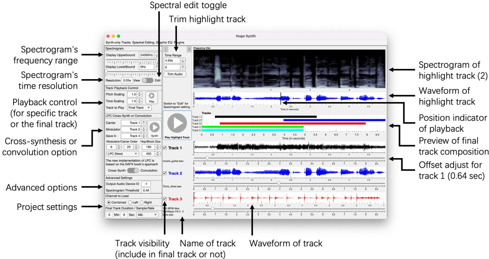
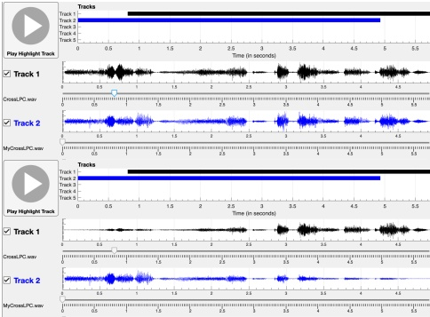
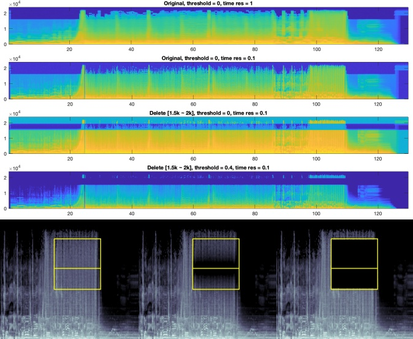
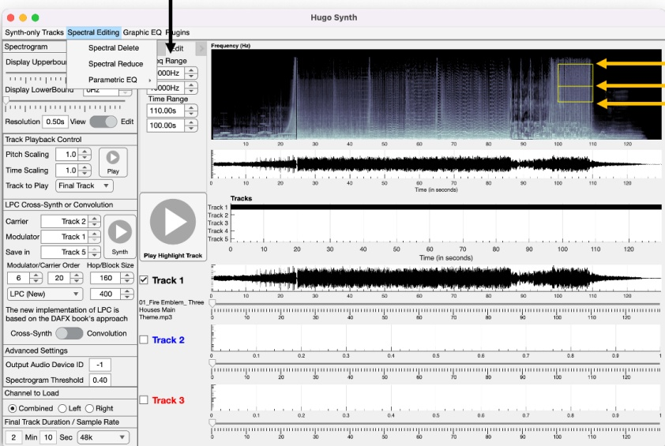
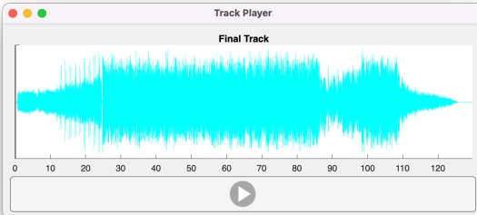
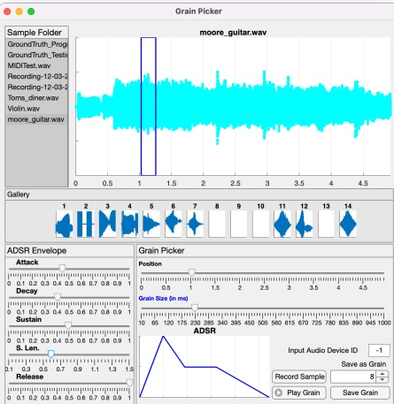
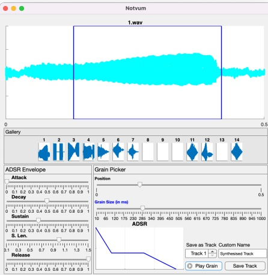
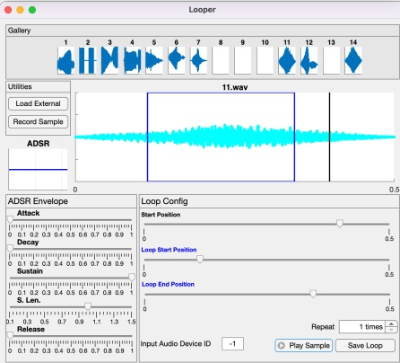

> This markdown file is auto-converted from [original report PDF](https://github.com/Trenza1ore/HugoSynth/blob/main/Original_Report.pdf)

## Overview of my Software 

The audio processing software I created consists of several components, each in the form of Matlab Apps.

- HugoSynth (Main Application)

- Graphic EQ (Graphic EQ for the Highlighted Track in Main App)

- Parametric EQ (Part of Main App's Spectral Editing Options)

- Grain Picker (Grain Recorder)

- Notvum (Granular Convolver)

- Looper (Loop Audio Samples)

-Track Player (Audio Playback with PSOLA-based pitch/tempo control)

-Offset Adjust (For the "Synth-only" Tracks)

## Basic Operations 

This is the main application, the user should first set the project settings: select a sample rate (defaults to 48000Hz) and the channel to load when loading in a sound file. The combined option takes the mean value across all channels and the left/right channel options are self-explanatory. Then the user can load in up to three tracks by right clicking (use two fingers if it's MacOS) in the area for each track and selecting "Load" in the context menu, this would call the app.LoadTrack method and a UI created by Matlab's uigetfile function would appear that allows the user to choose a file to load. All loaded files would be 

## Operate on the Highlight Track 

resampled to the set sample rate and the user would receive a warning if the sample rate is too low or too high. To perform crossfade between tracks, the user can select the "Cross-fade with [track]"option in the context menu of a track. This would perform a linear cross-fade effect as seen in the screenshots on the left.

Five tracks are available but track 4 and 5 are reserved for synthesis results, the user can't manually load a sound file into these two tracks.They can still be edited and processed like track 1-3, but menus for adjusting their offsets (start position in the final track) and removing them are at the top left in the menu bar named "Synth-only Tracks".

To simplify the menu logic of the main app, only the highlight track can have their spectrogram displayed and be spectral edited, trimmed or equalised via the graphic EQ. To highlight a track, simply click on a track in the preview of final track composition or alternatively, if it's not a synth-only track, select "Highlight" in its context menu.

The spectrogram displayed on-screen is calculated by Signal Processing Toolbox's pspectrum function with the 'spectrogram' option. This function allows for time resolution (in unit of seconds) to be adjusted easily and is the fastest option according to my testings, the spectrogram function does not work well with Matlab apps created with App Designer so that was not an option. The threshold value in the advanced options has a range of [0, 1) and is used to remove noises 

from the calculated spectrogram, when it is changed, the spectrogram is treated like a heat map and the heat values that are below the threshold-value-percentile are set to zero. As shown in the diagram on the next page, spectral editing operations like applying a band-stop filter introduce artefacts to the spectrogram and my percentile-thresholding approach can remove the artefacts. Changing threshold is instant because my program saves the original spectrogram and no recalculation is required.

For spectral filtering, Iexperimented with several ideas but ended up implementing the spectral editing features of the open source audio editing software Audacity. I chose Audacity as it is widely used in the industry and is well documented thanks to its open source nature. In the official manual, I discovered how they implement these tools and reimplement them in my app. Just like in Audacity,the center frequency is not visually in the middle of upper and lower frequency, but instead is the geometry mean of the two. This is more suited for spectral filtering as higher frequencies are less 

pronounced to human ears. My spectral delete tool is a band-stop filter in the selected area and my spectral reduce tool (equivalent to the Spectral edit multi tool of Audacity) applies a notch filter at the center frequency with this setting:Q-factor = center freq. - (upper freq. - lower freq.)

The diagram at the left shows the effect of two spectral reduce and a spectral delete on the same original spectrogram. My parametric EQ tool opens a plugin for equalising the selected area with the same setings as the notch filter of spectral reduce tool. The band-stop filter is implemented via the bandstop function of Signal Processing Toolbox, the notch filter has its parameters generated by the iirnotch function of the DSP Systems Toolbox and these parameters are passed into Matlab's filter function as the parameters for a rational transfer function that filters the selected area of the highlight track.Both my graphic EQ (that applies to the whole highlight track) and my parametric EQ (that applies to the area in the bounding box) plugins are created using Audio Toolbox and visualized with the parameterTuner function.

The changes in the highlight track can be applied by selecting "Apply Changes" in the context menu that can be opened at the spectrogram. Alternatively, the "Save in... [track]" options saves the edited highlight track in a specific track and the "Save as wav" option saves it as a wav file.

Control the upper/lower frequency and time range for the bounding box  

Upper frequency Center frequency Lower frequency 

## Playback (Track Player Plugin)

The audio playback menu at the top-left of the main app allows the final track (composed of all five tracks) or a specific track to be played back with its pitch and tempo changed. The psola function defined in the psola.m file in the teaching material is used to process the track if the scaling for pitch and time are set to a value other than 1. When the play button is clicked, a plugin (another Matlab app that I wrote) called Track Player is opened. This plugin gives the user the ability to control the playback's current position like the playback of highlight track in main app by clicking in the waveform diagram. The position 

indicator is updated with a fixed-rate timer that updates the current position of the playback with Matlab's refreshdata function. The timer updates every 0.5 second (same with highlight track in main app) so there may be a tiny bit of lag. But that's an optimization decision and a commercial-software level solution is outside the scope of this project. The user can save this psola-processed track by opening a context menu in the displayed waveform graph and selecting "Save".

## Cross-synthesis and Convolution between Tracks 

Under the audio playback menu of the main app, there is a menu to perform cross-synthesis or convolution between two tracks and save the result in a track.I have two implementations for cross-synthesis, both based on Linear Prediction (LP)Coding. The "new" implementation is based on a method described in the book DAFX: Digital Audio Effects, it doesn't use any form of Fourier Transform unlike other cross-synthesis algorithms and instead its operation is as the following:

-Slice both the carrier and modulating signal into frames with a length of hop sie 

- For each frame:

- Calculate the LP coefficients of both signals on a block of the signal whose size is defined as block/window size 

- Store the variance of prediction error as gain factors 

- Compute the excitation of the carrier signal 

-Compute the gain 

-Use the modulating signal's LP coefficients, carrier excitation and gain in a feedback loop to compute the output,modulated carrier signal 

>> calc_lpc([0 000 0],3)I used the calc_lpc function supplied by the book, the code has the line "may be used for educational ans =purposes" in the header comment section and this project is not for commercial purpose.I used this 1000function instead of Signal Processing Toolbox's lpc function because that function was faulty in Matlab 6>> lpc([0 000 0],3)as mentioned in the book and is still faulty according to my test results. As for cross-synthesis,I rwrote ans =the code instead of using the one supplied with the book because of its typos and (subjectively) poor 1NaN NaN NaN readability.I have also used the name "carrier" and "modulator" instead of "source" and "envelope"because the former names are more widely used in materials describing cross-synthesis.

The "old" implementation was what I created before reading the DAFX book, it first calculates the Short-time Fourier Transform (STFT) of both signals, then LPC is used to extract the spectral envelopes of both signals. The carrier signal's STFT is divided by its spectral envelope and multiplied by the modulating signal's spectral envelope to obtain the STFT of the modulated carrier signal. The reverse STFT is the used to obtain the modulated carrier signal.

The "old" implementation of LPC cross-synthesis seems to blur out the modulating signal more as it essentially only has one time frame, it can sometimes create more "musical" results so I decided to keep it in the final project. For the convolution, I used the method as described in the lectures and utilised the convolution theorem to compute the convolution between two audio signals.

## About Novum 

I discovered that the "cross-synthesis" aspect of the plugin Novum (as mentioned in coursework requirement) seems to be just a promotional term for a (perhaps fine-tuned) granular convolution other than actual cross-synthesis after some testing, so my cross-synthesis is not to be confused with that. Although I can be incorrect as they may have some proprietary algorithm that targets the usage specifically (Novum accepts MIDI inputs only and is expected to output music other than "speaking music" as for the usual cross-synthesis algorithms).

## The Grain Picker Plugin 

This plugin can be opened through the "Plugins" menu at the top of the main app and is where the user is able to record grains just like in the original hardware version of the Granular Convolver. The original hardware had 20 slots for recording grains and the only control options are adjusting the grain size and position of the grain. My software implementation only has 14 slots because of App Designer's limitations in 

the subplot function (the subplots need to have their resizability disabled and 14 is already making the subplots narrower than they should). Although the decreased slot number is not actually crucial due to the fact that all grains are stored in a "Grains" folder in the path of Matlab so the user can access the saved grains directly and save copies of them in other folders.

To load a sample where grains can be extracted, the user can either record a 5-second sample (like in the hardware version)or load a directory where samples are stored by opening a context menu in the top-left "Sample Folder" area and selecting "Load Directory". The user can then click on the files listed in the "Sample Folder" area to load it. Unlike the traditional definition of grains, the hardware Granular Convolver has grains that are quite large, so I set the grain size range to be [1Oms,1s). To provide envelope shaping for the grains,I added the ability to define ADSR envelopes that would be applied to the grains. The user can save or load ADSR envelope setings by opening a context menu in the ADSR Envelope area (and also the ADSR shape-preview graph) and selecting "Save/ Load Envelope". The file extension is .adsr and I utilised Matlab's ability to load/save double arrays as ASCll files to implement this quality-of-life feature. The extracted grains can be played by clicking on its waveform in the "Gallery" area at the middle.

The user should only set the input audio device id if they know what they are doing, if the id displayed on screen is changed,it's either because the user entered an id of a faulty device or the device is plagued by a bug of Matlab (further discussions on input /output audio devices and the bug is in a later section of the report).

## The Matlab Audio Player Bug 

##  The Notvum Plugin 

This plugin can also be opened through the "Plugins" menu at the top of the main app. When it is opened and a grain is loaded (by clicking on its waveform in the "Gallery" area), the playback of the highlight track in the main app would be replaced by the result of Granular Convolution between the loaded grain (after slicing it with the grain position and grain size slider and applying an ADSR envelope on it) and the highlight track.Like in the hardware Granular Convolver, the result is the convolution of the highlight track and a looped version of the grain.I planned to perform psola-based granular synthesis on the highlight track and convolve the extracted grains of the track with the loaded grain, but the plugin for it cannot be finished in time of this submission due to time constraints.Although a near-identical effect can still be achieved by saving a pitch/tempo altered version of the track in the Track Player plugin and highlighting it to convolve with the selected grain in this Notvum plugin.The result of Granular Convolution can be saved to a track in the main app and the name can be customized by the options at the botom-right of the plugin.

## The Looper Plugin 

This plugin allows the user to loop a sample or a grain. This looping is a bit different to the method described in the lecture and the looped sample is actually:

[start_position:end] + RepeatNumber* [loop_start:loop_end]

I used this method because Novum has a start position slider that works like this.

## The Offset Adjust Plugin 

It's opened when the user opens the Synth-only Tracks menu at the topleft of the main app and chose a track to adjust the offset of. There is no space to include track 4 and 5 in the main app's user interface but I still want more than 3 tracks, therefore this plugin was created to adjust track 4 and 5's offset.

After experiencing "Internal Device Error" several times during the development,I pinned down the cause to be the fact that a pair of headphones is usually connected to my MacBook when opening Matlab and sometimes I unplug it before using Matlab's audioplayer function or sound function (which internally uses audioplayer). After some research, I found that this is indeed a bug of Matlab and it was first documented back in 2018 in this thread: https://uk.mathworks.com/matlabcentral/answers/446608-internal-device-error-when-playing-sound-after-plugging-unplugging-headphones-r2018b-9-5-0-944444

It would seem that this bug remains unpatched and workaround is to use the audiodevinfo function to check if the current audio input/output device supports mono audio record / playback at a sample rate of 44.1kHz. If it doesn't support such basic feature, it must have been because of this bug, then the function is called again to find the first device that support this feature.I created a helper function called CheckAudioDevice to do the above-mentioned workaround. As a result of this debugging work,I decided that being able to set input / output audio device's id to be called when using audioplayer is very important and allows the user to change it during runtime.

## How each basic requirement is fulfilled:

How they are fulfiled has been discussed in previous sections, so this part is mainly just noting which Matlab App is in charge of fulfilling the reguirement.

Read in audio file and filter via editing its Spectrogram:

main app (Hugo Synth)

## Playback with pitch / tempo controlled:

main app (Hugo Synth)

## Granular convolution:

grain recorder (Grain Picker Plugin) + grain convolver (Notvum Plugin)

## Audio layer editing:

main app (Hugo Synth)

## High-level convolution between audio layers:

main app (Hugo Synth)

## ADSR envelope for grains:

grain recorder (Grain Picker Plugin) + grain convolver (Notvum Plugin)

## ADSR envelope for audio samples:

looper (Looper Plugin), set start position and repeat number to 0

## Cross fade between layer:

main app (Hugo Synth), select cross-fade in a track's context menu 

## My Novel Features:

My software has a relatively advanced, user-friendly editor for audio that supports five audio layers, three of them can be loaded directly by the user and two of them can be used to store synthesis results.

My playback of the final track also has the five tracks being played all at once instead of only being able to play one track at a time. The position of each track in the final track can be adjusted by changing its offset via my Ul and they can each be trimmed down.

My Grain Picker plugin can record audio and save multiple grains which can be directly accessed just like the actual hardware Granular Convolver. Each grain can also be applied a ADSR envelope and the envelope can be saved and loaded.

My Notvum plugin allows the user to "extract grain from the saved grain" and apply ADSR envelope again if needed, it is also easy to use and similar to Novum in how it functions.

Ihave graphic EQ plugin for equalisation of the highlighted track and parametric EQ plugin for equalisation of the selected region in the bounding box when performing spectral editing, which also has most of the features of Audacity, a software that has became an industry standard.

Exporting audio out as wav files is also provided as a feature in almost all of the interfaces.

Convolution and cross-synthesis can be performed on two tracks and saved in another track. Two implementations for LPC-based cross-synthesis were provided.

## Toolboxes and External Files Used:

- psola.m + PitchMarker.m (code supplied in lectures)

- cal_lpc.m (code supplied in the DAFX book)

- Signal Processing Toolbox 

- DSP Systems Toolbx 

- Audio Toolbox 

- Parallel Computing Toolbox (parallel computing implemented in cross-synthesis but was unused)Other .m files are my own work.

## References:

-Audacity (2022) Spectral selection and editing, Spectral Selection and Editing - Audacity Manual.Audacity. Available at: https://manual.audacityteam.org/man/spectral_selection.html (Accessed:December 8,2022).

-Smith, J.O. (2011) Spectral Audio Signal Processing. Stanford, Calif.?: W3K.

-Zolzer, U. (2011) DAFX: Digital Audio Effects, second edition. Chichester: John Wiley & Sons, Ltd.

